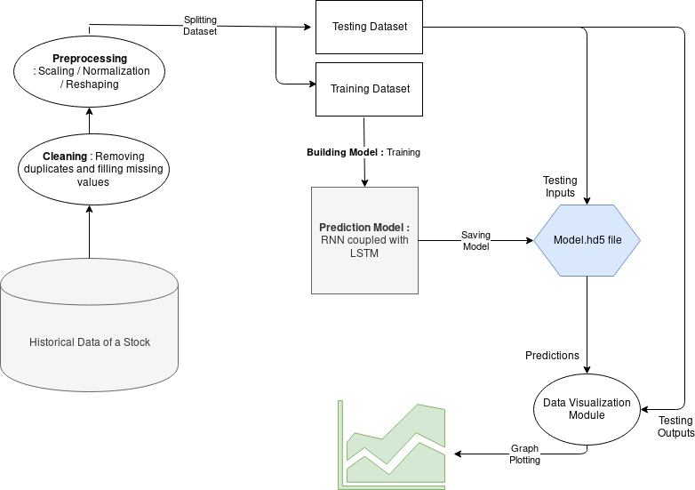
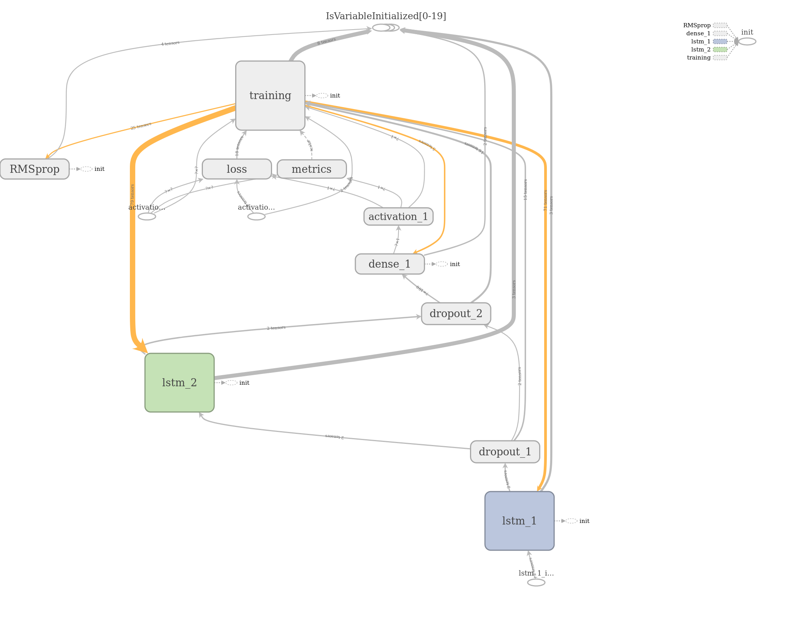
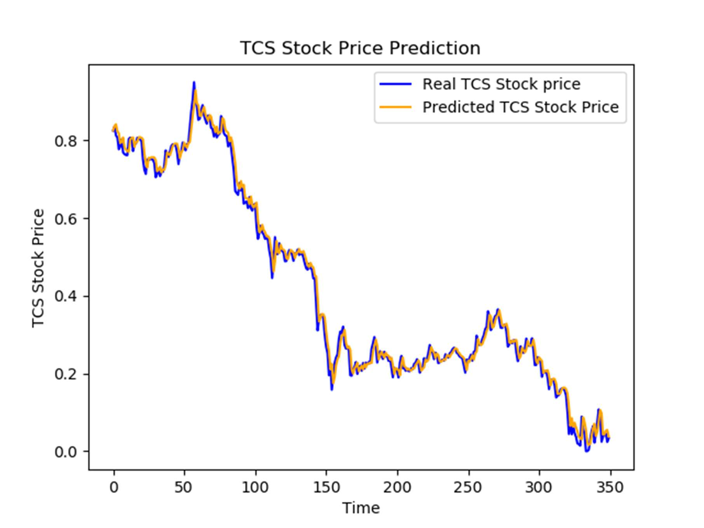
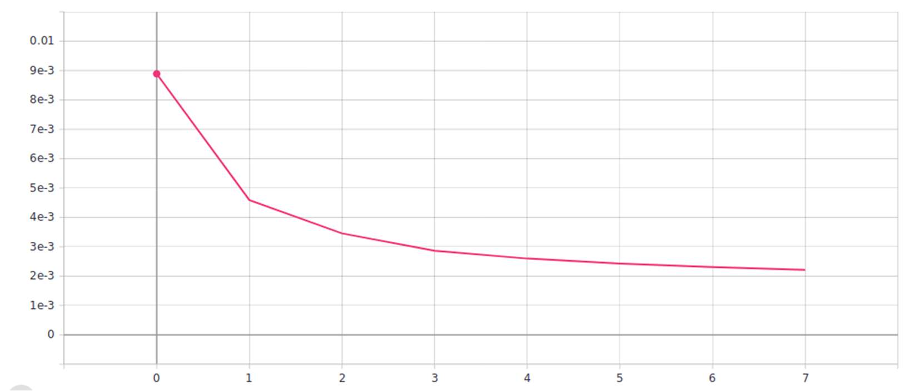

# StockStalker

## Abstract

This project comes under the category of algorithmic trading. We are developing a prediction model for AI trading bot that can trade in real stock market for a company’s stock within a single day, that is, do Intraday trading. Predictions of our model will we based on historical data of company’s share, that is, price of their share taken at one minute interval, for every working day of every month, for the past 2 to 3 years, and other state variables and technical indicators. Our software will be adaptive to both bull and bear market with high tolerance. At the end of the day, our project will be able to demonstrate real-time trading in stock market with virtual money. For making money, it doesn’t have to predict stock price movement correctly all the time. If it predicts 6 times out of 10 correctly, it will make money in the market.

**Keywords**: Intraday trading, stock prediction, RNN, LSTM.

## Problem Statement

Stock market is totally unpredictable but lucrative market. And it has allured many investors and businesses over centuries. Because of its complex nature, a normal person finds it difficult to invest in it. But many of them get sucked into its glory. They invest in stocks which are totally random and risky due to their high volatility. We propose a solution to decrease the risk and save a day-to-day person from great monetary loss.

## Objective

Predicting the Stock Market has been the bane and goal of investors since its existence. Everyday billions of dollars are traded on the exchange, and behind each dollar is an investor hoping to profit in one way or another. A chief objective of this project is to analyzes the previous stock data of certain companies and predict the appropriate results for investors to save them from the risk of financial loss.

## Scope

This software can be used in all the financial and investment centers including, Hedge Funds, Mutual Funds, Investment banks and even by a daily person. It eliminates the need of technical analysis of stocks which is time consuming and error prone. And most probably, it’ll eliminate the need of fundamental analysis of stocks too when newsfeeds and other sources are integrated to it.

## Platform Specifications

### Hardware Requirements

● **RAM** : At Least 4GB recommended. Because huge datasets will pe loaded into it for processing.

● **Storage** : As per the size of dataset + 100 MB for program itself.

● **Processor** : For development and testing Intel® CoreTM i5-6200U CPU @ 2.30GHz × 4 was used. And it took about 88 seconds per epoch for training which is quite decent. Hence, Processor above this configuration or comparable to it is recommended. Slower processor may lead to latent predictions and it’ll be harmful for real-time trading.

● **GPU** : Nvidia GPUs that support Cuda and tensorflow integration. Trading is a time sensitive task and faster performance is always appreciated.


### Software Requirements

● **Python** and its Packages

○ **Keras** - For creating deep learning model.

○ **Pandas** - For Loading and handling the Huge Dataset of Stock Prices.

○ **Numpy** - For preprocessing data and making it compatible for Keras and Matplotlib.

○ **Matplotlib** - For Data visualization purpose.


## Proposed Solution

**Requirements** : Our Project requires the historical data of a stock (here we are experimenting with TCS’s share) with high frequency intervals (one minute data) for more than 500 working days in chronological order, from 9:15AM to 3:30PM daily, that is, 375 minutes per day. Making total of 375 x 500, that is, 187500 plus samples. 



**Techniques/Algorithms** : After cleaning data - removing duplicates and filling missing values - normalization is done to avoid false prioritization of any feature and to provide a generalized model. Since we have Univariate Time Series Data, we are reshaping it into a 3 dimensional array of dimensions - Samples, Timesteps and features. Which is further fed into the Recurrent Neural Network with LSTM (Long Short Term Memory) cells for training. Trained model is saved and scaled back predictions are compared with original data for validating its accuracy.



## Usage

**Note :** It is recommanded to create a virtual environment or docker container to avoid tampering with the system's dependencies.

```
pip install virtualenv
mkdir StockStalker
cd ./StockStalker
virtualenv ./
source ./bin/activate
```

Installing Pre-requisites
```
pip install keras
pip install pandas
pip install matplotlib
pip install numpy
```

Cloning from repository
```
git clone https://github.com/sanskarjain1997/StockStalker.git
cd StockStalker
```

Training Neural Net on TCS Stock price data
```
python exp.py train TCS
```

Predicting from created model file
```
python exp.py predict TCS
```

## Results

Predictions graph : 



Loss Graph : 



## Future Prospects

● Integration of trading bot.

● Support for real-time trading.

● Increasing reach to global domain.

● Fundamental Analysis of Stocks.

● Sentiment Analysis on News Feeds that potentially affects Stock prices.
